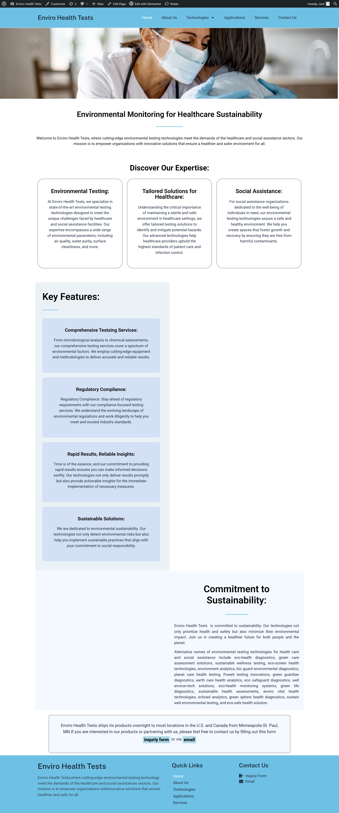
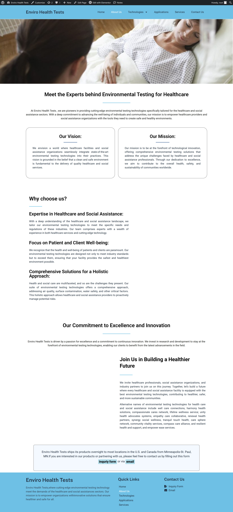
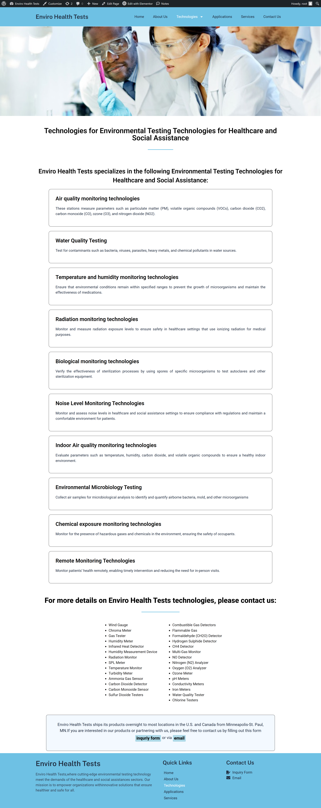
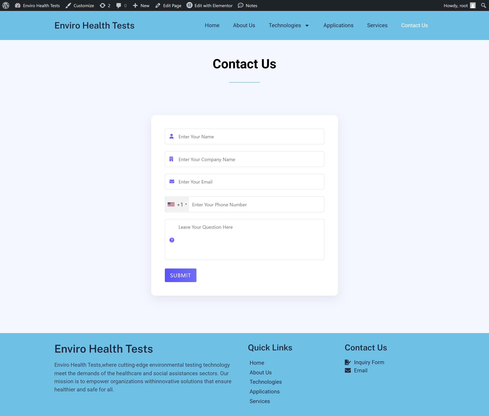

# 🌍 Enviro Health Tests Website

## 📌 Project Overview

The **Enviro Health Tests Website** is a fully responsive, multi-page website developed during my web development internship.

This project focuses on delivering **environmental health testing solutions** through a clean, user-friendly interface built with real-world design standards and requirements.

It demonstrates my ability to:

* Build structured multi-page websites
* Maintain UI/UX consistency
* Work with WordPress + frontend technologies
* Deploy and manage live projects

---

## 🎯 Internship Context

This project was developed as part of my internship under **WebDev Nova Squad**.

* 📋 Assigned as a real-world task
* 👨‍💻 Built independently following provided documentation
* ✅ Successfully reviewed and approved by the squad leader

---

## 🚀 Key Features

* 🌐 Fully responsive (Mobile + Tablet + Desktop)
* 🧭 Smooth navigation across all pages
* 🎨 Clean and consistent UI/UX design
* 📄 Well-structured content layout
* ⚡ Fast loading and optimized pages
* 📬 Functional contact section
* 🔗 Live deployed website

---

## 🛠️ Technologies Used

### 🌐 Frontend

* HTML5
* CSS3
* JavaScript

### 🧩 CMS & Tools

* WordPress
* Elementor (Page Builder)

### 💻 Development Environment

* XAMPP (Local Server)

### 🚀 Deployment & Hosting

* InfinityFree

### 🔄 Backup & Migration

* WPvivid Plugin

---

## 📂 Project Structure

```
Enviro-Health-Tests-Website/
│
├── Website ScreenShots/
│   ├── Home Page.png
│   ├── About Us Page.png
│   ├── Application Page.png
│   ├── Contact Us.png
│   ├── Service Page.png
│   ├── SubPage.png
│   └── Technologies.png
│
└── README.md
```

---

## 📸 Screenshots

### 🏠 Home Page



### ℹ️ About Us Page



### 🧪 Technologies Page



### 📊 Application Page


### 🛠️ Service Page


### 📞 Contact Us Page



### 📄 Sub Page


---

## 🔗 Live Website

👉 [https://envirohealthrahman.infinityfreeapp.com](https://envirohealthrahman.infinityfreeapp.com)

---

## 💡 What I Learned

Through this project, I gained hands-on experience in:

* Building real-world websites using WordPress
* Designing responsive layouts
* Structuring multi-page navigation systems
* Using Elementor efficiently
* Deploying websites to live servers
* Managing backups and migrations

---

## ⚡ Challenges Faced

* Ensuring consistent UI across all pages
* Maintaining responsiveness on different devices
* Optimizing layout using Elementor
* Fixing deployment and hosting issues

---

## 📈 Future Improvements

* Add SEO optimization
* Improve performance (lazy loading, compression)
* Enhance animations and interactivity
* Integrate backend form handling
* Add analytics tracking

---

## 👨‍💻 Author

**Mohammed Abdul Rahman**
Web Development Intern

---

## ⭐ Support

If you found this project useful, feel free to ⭐ star the repository!
* Make this into a **top-tier portfolio README (with badges + icons + stats)**
* Or help you write a **LinkedIn post that gets attention for this project**
